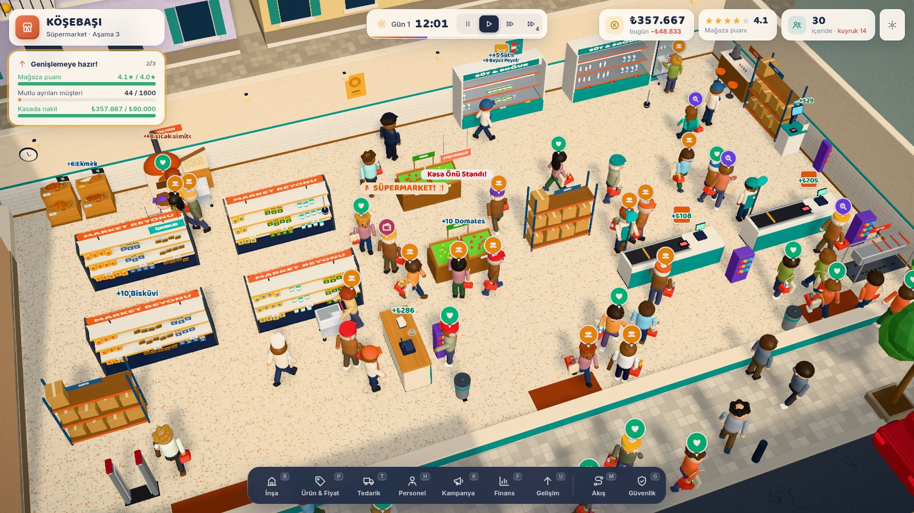
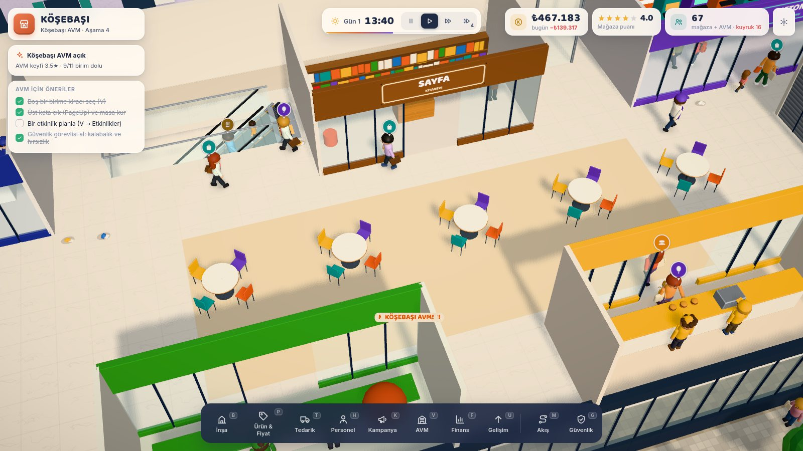
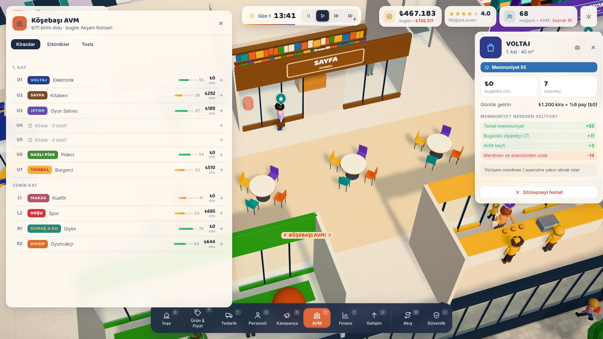
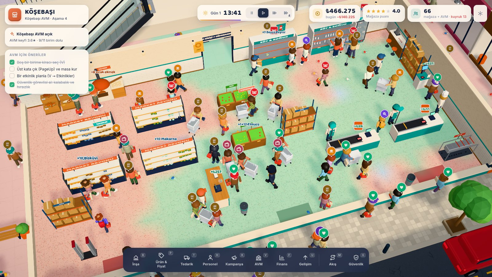
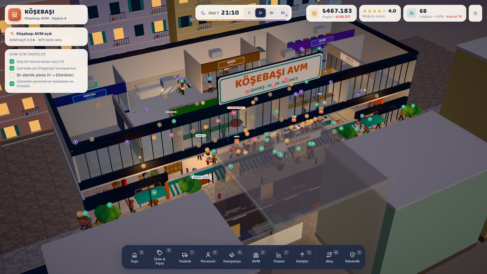
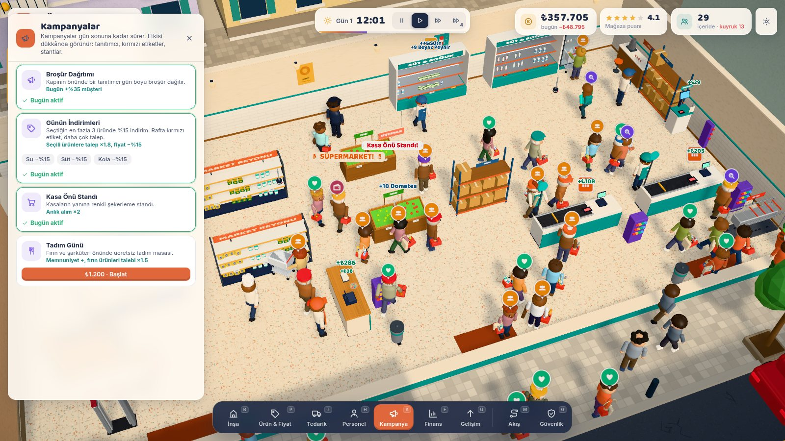
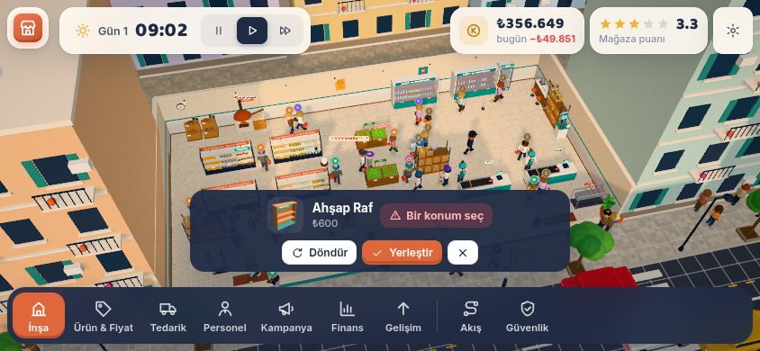

# Tezgâh — Büfeden AVM'ye

> **Yeni ana sürüm Godot'da:** [`godot/`](godot/README.md) klasörü. Masaüstünde normal bir oyun gibi çalışır, npm gerekmez; yeni görsel yön, Fredoka/Nunito tipografi ve animasyonlu karakterlerle geliyor. Kurulum adımları [godot/README.md](godot/README.md) içinde. Aşağıdaki metin, kökteki **web (Three.js) sürümünü** anlatır. Web sürümü dört aşamanın hepsini içeriyor ve Godot'ya aşama aşama taşınıyor.


Sıcak, esprili ve okunaklı bir **3D perakende yönetim oyunu**. Köşedeki küçük bir büfeyle başlarsın; rafları dizer, fiyatları ayarlar, stoku yönetir, personel alırsın. Yan dükkânı devralıp **Mahalle Marketi**'ne, ardından bantlı kasaları ve fırınıyla bir **Süpermarket**'e, en sonunda kiracıları, yemek katı ve etkinlikleriyle iki katlı **Köşebaşı AVM**'ye dönüşürsün.

> Dört aşamanın dördü de oynanabilir. Neyin uygulandığı ve neyin **hâlâ eksik** olduğu aşağıda açıkça yazıyor.



| AVM 1. kat: yemek katı ve kiracı vitrinleri | AVM paneli + kiracı memnuniyeti ("neden?") |
|---|---|
|  |  |
| **Güvenlik katmanı (`G`): kamera ve görevli görüşü** | **Gece: AVM dış cephesi** |
|  |  |
| **Kampanyalar** | **Telefon (yatay), dokunmatik yerleştirme** |
|  |  |

İlk dikey kesitten kalan görüntüler: [ana ekran](docs/screenshot-main.jpg) · [yerleştirme](docs/screenshot-build.jpg) · [ürün paneli](docs/screenshot-products.jpg) · [market](docs/screenshot-market.jpg) · [gece](docs/screenshot-night.jpg)

---

## Hızlı başlangıç

```bash
npm install
npm run dev        # http://localhost:5173
# veya üretim derlemesi:
npm run build && npm run preview
```

Gereksinim: Node 18+ ve WebGL2 destekleyen güncel bir tarayıcı (Chrome, Edge, Firefox, Safari 17+).

URL parametreleri (test için):

| Parametre | Etki |
|---|---|
| `?q=balanced` / `?q=low` | Grafik kalitesi (varsayılan `high`: GTAO + bloom + 2K gölge) |
| `?para=200000` | Başlangıç nakdini değiştirir (genişlemeyi hızlı görmek için) |
| `?load=1` | Açılışta yuva 1'deki kaydı yükler (`oto`, `1`, `2`, `3`) |

## Kontroller

| Girdi | İşlev |
|---|---|
| Sol tık | Seç (müşteri, personel, raf, kiracı birimi, yürüyen merdiven) · yerdeki çöpe tıkla: temizle · ıslak zemine tıkla: paspas ata |
| Sağ tık + sürükle / `WASD` | Kamerayı kaydır |
| Orta tık + sürükle / `Alt`+sol / `Q` `E` | Kamerayı döndür |
| Tekerlek / `+` `-` | Yakınlaş / uzaklaş (çok uzaklaşınca duvarlar yükselir, dış cephe görünür) |
| `B` `P` `T` `H` `K` `F` `U` `V` | İnşa · Ürün & Fiyat · Tedarik · Personel · Kampanya · Finans · Gelişim · AVM |
| `M` · `G` | Akış ısı haritası · Güvenlik katmanı (kamera ve görevli görüşü, kör noktalar) |
| `PageUp` `PageDown` / `]` `[` | AVM'de kat değiştir |
| `R` | Yerleştirirken döndür · `Shift`+tık: arka arkaya yerleştir · `Esc`: iptal |
| `Boşluk` · `1` `2` `3` | Duraklat · 1× / 2× / 4× hız |
| `C` | Kesik duvar görünümünü aç/kapat |
| `O` / `Esc` (boştayken) | Ayarlar & Kayıtlar |

**Dokunmatik (telefon ve tablet):** tek parmak sürükle: kaydır · iki parmak kıstır: yakınlaş · iki parmak çevir: döndür · dokun: seç. Yerleştirirken dokunduğun karoya hayalet model taşınır, alttaki **Döndür / Yerleştir / İptal** düğmeleriyle onaylanır. 900 px altındaki ekranlarda paneller alttan açılan sayfalara dönüşür, dock yatay kaydırılır.

---|---|
| Sol tık | Seç (müşteri, personel, raf) · yerde çöpe tıkla: temizle |
| Sağ tık + sürükle / `WASD` | Kamerayı kaydır |
| Orta tık + sürükle / `Alt`+sol / `Q` `E` | Kamerayı döndür |
| Tekerlek / `+` `-` | Yakınlaş / uzaklaş (çok uzaklaşınca duvarlar yükselir, dış cephe görünür) |
| `B` `P` `T` `H` `F` `U` | İnşa · Ürün & Fiyat · Tedarik · Personel · Finans · Gelişim |
| `M` | Akış (müşteri trafiği) ısı haritası |
| `R` | Yerleştirirken döndür · `Shift`+tık: arka arkaya yerleştir · `Esc`: iptal |
| `Boşluk` · `1` `2` `3` | Duraklat · 1× / 2× / 4× hız |
| `C` | Kesik duvar görünümünü aç/kapat |

---

## Dikey kesitte neler var (uygulandı)

**1. Kurulabilir, düzenlenebilir büfe**
- 8×6 m iç mekân, hazır bir başlangıç düzeniyle açılır. Her eşya taşınabilir, döndürülebilir, satılabilir (%50 iade).
- Yerleştirme kuralları gerçek zamanlı doğrulanır: eşya dükkânın içinde olmalı, kapı girişi boş kalmalı, rafın önü (müşteri erişimi) açık olmalı, kasanın arkasında kasiyere yer olmalı. **Hiçbir raf, kasa ya da kapı ulaşılamaz hâle gelmemeli.** Bunu, yerleştirmeden önce yol bulma testi (BFS) denetler. Hayalet model yeşil ya da kırmızı olur, sebebi alt çubukta yazar.

**2. Raf, soğutucu, kasa, depo ve 7 ürün**
- Ahşap raf (kuru gıda), cam kapaklı içecek dolabı, iki katlı fırın sepeti, kasa tezgâhı, depo rafı, saksı bitki, çöp kovası.
- Ürünler: Cips, Çikolata (anlık alım ürünü), Bisküvi, Kola, Ayran, Simit, Ekmek. Her ürünün teşhir tipi (raf, soğutucu, sepet), toptan maliyeti ve beklenen fiyatı var.
- Raflardaki ürünler tek tek 3D olarak görünür, satıldıkça gözle görülür biçimde azalır. Her bölmenin önünde fiyat etiketi durur; stok azalınca etiket turuncuya, bitince kırmızıya döner.
- Depo rafındaki koliler yedek stok miktarına göre azalır. Toptancı minibüsü sokağa gelip teslimatı yapar.

**3. Müşteriler (sadece dolaşan figürler değil)**
- Dört arketip: **Öğrenci**, **Emekli**, **Beyaz Yaka** ve Market'te açılan **Aile Alışverişçisi**. Her birinin bütçesi, alışveriş listesi, fiyat toleransı, sabrı, yürüme hızı, çöp atma eğilimi ve saatlik talep eğrisi farklı. Sabahları emekliler ekmek ve simit, öğleden sonra öğrenciler cips ve kola ister.
- Davranış döngüsü: kaldırımdan gelir, kapıda kalabalığı tartar (çok kalabalıksa döner), listedeki ürünleri en yakın raftan arar, fiyatı ve bütçesini kontrol eder, en kısa kuyruğa girer, öder ya da sabrı biterse sepeti bırakıp gider.
- Okunabilir tepkiler: başın üstünde vektör ikonlu baloncuklar (boş raf, çok pahalı, bulamadım, bekliyorum, kirli, kalabalık, mutlu). Yüz ifadesi (kaş ve ağız) ve animasyon (sinirlenme, sevinme, uzanma, ödeme) ruh hâline göre değişir. Müşteriye tıklayınca portresi, listesi, sepeti, sabır barı ve **"aklından geçenler"** günlüğü görünür.

**4. Çalışan oyun döngüsü**
- Stok, satış, kâr ve memnuniyet birbirine bağlı: boş raf ve pahalı fiyat ruh hâlini düşürür, ruh hâli mağaza puanını, puan da gelen müşteri sayısını belirler.
- Personel: Kemal Usta (sahibi) kasaya bakar. Kuyruk boşsa ve reyon görevlisi yoksa rafları kendisi doldurur, o sırada **kasa boş kalır**. Reyon görevlisi depodan koli taşır ve çöp toplar.
- Tedarik: elle sipariş (+6/+12/+24) ya da ürün başına otomatik sipariş. Depo kapasitesi sınırlı.
- Gün döngüsü 07:00–22:00 arası. Gün batımı, gece ışıkları, sokak lambaları ve vitrin ışıkları gerçek zamanlı değişir. Gün sonunda kira ve maaş ödenir, bir **gün sonu raporu** çıkar ve rapor otomatik çıkarımlar içerir ("simit 26 kez bulunamadı" gibi).

**5. Yerleşim kararlarının görünür etkisi**
- Kuyruk, kasanın müşteri tarafından en yakın kapıya uzanan gerçek bir yol boyunca dizilir. Kasa kapıya yakınsa kuyruk kaldırıma taşar. Kasa seçiliyken bu yol sarı kesikli çizgiyle gösterilir.
- **Anlık alım:** kuyruk yolunun hemen yanındaki raflardaki çikolata ödeme öncesi sepete eklenir.
- Dar koridorlarda müşteriler yavaşlar ve "sıkıştım" tepkisi verir. Bitkiler ortam puanı ve sabır kazandırır. Çöp kovası yakınına çöp atılmaz.
- **Akış haritası (`M`):** müşterilerin gerçekte nereden geçtiğini gösteren ısı haritası.

**6. İlk genişleme ve yükseltme kararları**
- Yükseltmeler: **Neon Tabela** (daha fazla müşteri, gece parıltısı), **Temassız POS** (ödeme süresi −%35, kasada terminal belirir), **Yeni Tente & Vitrin**.
- **Yan dükkânı devral:** puan ≥ 3,6★, 200 mutlu müşteri ve ₺12.000 nakit hedefleri tamamlanınca kepengi inik komşu dükkân ve arka avlu kalkar. İç mekân 16×10 m olur, ikinci kapı açılır. Kira artar. Orta gondol, manav tezgâhı, açık soğutucu, 3 kasaya kadar kasa, süt / deterjan / domates / elma, aile alışverişçileri ve temizlik görevlisi açılır.

**7. Ana oyun ekranı**
- Tek bir 3D sahne, soldan sağa sıcak bir mahalle: eczane, berber, çay ocağı, kırtasiye, fırın, balkonlu apartmanlar, trafikte arabalar, uyuyan kedi, çamaşır ipi. Dükkânın içini kapatan binalar ve duvarlar kameraya göre otomatik olarak saydamlaşır ya da alçalır.
- Arayüz, dünyayı kapatmayan kompakt kartlardan oluşur. Sorun önce dünyada görünür (raf rozetleri, baloncuklar, kuyruk, çöp); ayrıntı için tıklanır.

## İkinci aşamada eklenenler (uygulandı)

**Süpermarket (Aşama 3)**
- İç mekân 24×12 m'ye büyür, üç kapı açılır. Yeni eşyalar: **Bantlı Kasa** (ödeme −%35, bant döner), **Self-Servis Kasa** (kasiyer gerekmez ama yavaş ve kayıp riski var), **Fırın Tezgâhı** (fırıncı simit ve ekmeği ucuza pişirir, fırın ağzı parlar, müşteri "sıcacık" tepkisi verir), **Alışveriş Arabası Parkı**, tavandan asılı **Reyon Levhası** (levhasız reyonlarda müşteri ürünü daha geç bulur).
- Yeni ürünler: Makarna, Çay, Beyaz Peynir, Su. Yeni arketip **Haftalık Alışverişçi**: 5–8 kalemlik liste, araba iter, araba parkı yoksa listesi kısalır.
- Market ve Süpermarket'e özel yükseltmeler: Elektronik Raf Etiketi, Sıcak Raf Aydınlatması, Otopark Anlaşması, Sadakat Kartı.

**Köşebaşı AVM (Aşama 4)**
- Mahalle yıkılmaz. Süpermarket zemin katın ortasında kalır, çevresine iki katlı bir AVM kabuğu kurulur: mermer zeminler, cam korkuluklu galeri, otomatik kapılı iki giriş, cam giydirme cephe, gece yanan dev tabela.
- **Katlar arası ulaşım:** yukarı ve aşağı yürüyen merdiven (bant dokusu kayar) ve cam asansör (kabin binen kişiyle birlikte hareket eder). Emekli çiftler asansörü tercih eder. Yürüyen merdivenler saatlik şansla **arızalanır**: kırmızı bariyer çıkar, ziyaretçiler asansöre yönelir. Tamiri ₺600 ve 40 oyun dakikası sürer.
- **11 kiracı birimi** (zeminde 4, üst katta 5 mağaza ve 2 yemek standı). Her sabah birimlere 10 kurgusal markadan teklif gelir (giyim, elektronik, kitabevi, oyuncakçı, kuaför, oyun salonu, spor, kahveci, burgerci, pideci). Her kiracının kirası, ciro payı ve bir kuralı vardır: "yürüyen merdivene yakın olmak ister", "gürültülü komşu istemez", "oyun alanına yakın olmayı sever"… Memnuniyet her an **gerekçeleriyle** gösterilir (+/− satırları). İki gün mutsuz kalan kiracı çıkar.
- **AVM ziyaretçileri** (Genç, Aile + çocuk, Profesyonel, Emekli Çift) mağazaları gezer, yemek katında sipariş verip masaya oturur, oyun alanında oyalanır, bankta dinlenir. Masa yoksa ayakta yer, masa kirlenirse temizlik görevlisi toplar.
- **Etkinlikler:** Akşam Konseri (sahne ve sanatçı kurulur), İmza Günü, Bayram İndirimleri, Çocuk Şenliği. Bugüne ya da yarına planlanır; süsler, balonlar, pankartlar görünür. Güvenlik görevlisi yoksa kalabalıkta arbede çıkabilir.
- Yeni gider ve gelirler: kira yerine elektrik ve bakım gideri, günlük kiracı kirası ve ciro payı. Gün sonu raporunda AVM satırları yer alır.

**Güvenlik ve hırsızlık**
- Market'ten itibaren **Fırsatçı** arketipi gelir (kapüşonlu). Kimsenin bakmadığı raftan ürünü cebine atar. Görevli yakındaysa vazgeçer, kamera görürse "şüpheli" olarak işaretlenir ve güvenlik görevlisi peşine düşer.
- **Güvenlik kamerası** (dönen kafa, 6 m görüş konisi; raf, gondol ve dolaplar arkasını görmeyi engeller), **Alarm Kapısı** (ödenmemiş ürünle geçişte öter ve ışık yanar), **Güvenlik Görevlisi** (devriye, kovalamaca, kapıda yakalama). `G` katmanı kör noktaları kırmızı gösterir.
- Kayıp, gün sonu raporunda ayrı satır olarak ve sayım farkı ("rafta eksik çıktı") şeklinde görünür.

**Islak zemin ve temizlik**
- Müşteriler içeceklerini dökebilir, soğutucular zaman zaman su sızdırır. Islak zeminde müşteri **kayıp düşer** (animasyon, moral kaybı, rapor satırı). Temizlik görevlisi önce sarı "Dikkat Islak Zemin" levhası koyar, sonra paspaslar. Levha kuruyana kadar bekler. Yere tıklayarak birini doğrudan görevlendirebilirsin.

**Vardiya ve yorgunluk**
- Her personelin enerji barı var. Tam gün (07–22) yorar; enerji %30'un altına inince yavaşlar. **Sabah** ve **akşam** yarım vardiyaları %60 maaşla günü böler, vardiya dışı personel eve gider. **Çay Ocağı** kurulursa yorulan personel mola verir.
- Yeni roller: Güvenlik Görevlisi, Fırıncı.

**Kampanyalar** (`K`)
- Broşür Dağıtımı (kapıda tanıtımcı, +%35 müşteri), Günün İndirimleri (en fazla 3 ürün −%15, rafta kırmızı "İNDİRİM" etiketi, talep ×1,8), Kasa Önü Standı (kasalar yanında şekerleme standı, anlık alım ×2), Tadım Günü (fırın önünde tadım masası). Her kampanya dükkânda görünür bir nesneyle temsil edilir ve gün sonunda biter.

**Kayıt, yükleme ve ayarlar**
- Her gün sonunda **otomatik kayıt**, ayrıca üç elle kayıt yuvası (tarayıcının `localStorage`'ında). Açılış ekranında "Devam" düğmesi çıkar.
- Ayarlar (`O`): grafik kalitesi, kesik duvar, genel / müzik / efekt / ortam ses seviyeleri, arayüz ölçeği (%80–140), kısayol listesi.

**Müzik ve ortam sesi** (tamamen sentez, ses dosyası yok)
- Aşamaya göre değişen, üretken bir müzik katmanı: Rhodes benzeri akorlar, bas, pluck melodi ve darbuka "düm-tek" ritmi. Hicaz ve Dorian dizileri arasında geçer, gece sakinleşir, kalabalık arttıkça yoğunlaşır, duraklatınca söner.
- Ortam: trafik uğultusu, geçen arabalar, gündüz kuşlar, gece cırcır böcekleri, içerideki kalabalığa göre konuşma uğultusu. Kamera uzaklaştıkça sokak sesi baskınlaşır.

## Henüz uygulanmayanlar (açıkça)

- **Rakip dükkânlar** ve mahalle ölçeğinde pazar payı yok.
- **Oda sistemi** (personel-only depo odası, soğuk oda) yok. Depo hâlâ satış alanındaki bir raf.
- Fırın ürünlerinde **tazelik / bayatlama** yok. "3 al 2 öde" türü paket kampanyalar ve gondol başı (end-cap) teşhir yok.
- AVM'de **merdiven**, **tuvalet**, **sinema**, **tahliye** ve **bakım ekibi** yok. Arızaları oyuncu tek tuşla tamir ettirir. Ziyaretçilerin açlık dışında ihtiyaç barları (tuvalet, yorgunluk) yok.
- Oyuncu AVM'de yalnızca iki kat ve sabit bir birim düzeniyle oynar. Birimleri birleştirmek, bölmek ya da kat eklemek mümkün değil.
- Kayıtlar tarayıcıya bağlı (`localStorage`). Dosyaya dışa aktarma ve bulut kaydı yok. Kayıt para, eşyalar, raf ve depo stoku, siparişler, personel ve vardiyalar, yükseltmeler, kiracılar ve planlı etkinlikleri saklar. Gün sonu kaydı ertesi sabahtan devam eder. Gün ortasında alınan elle kayıt ise o günü sabah 07:00'den yeniden başlatır. O günün kampanyaları ve o an içerideki müşteriler kaydedilmez.
- Dokunmatik kontroller telefonda ve tablette çalışıyor, ancak arayüz masaüstü için tasarlandı. Küçük ekranda Ürün & Fiyat tablosu bazı sütunları gizler. Dikey telefon ekranı desteklenmiyor, yatay kullanılmalı.
- Tüm modeller ve dokular hâlâ prosedürel. Dış 3D model veya doku dosyası kullanılmadı.
- Denge ilk ayar düzeyinde. Büfe → Market birkaç oyun günü sürüyor. Süpermarket ve AVM hedefleri (1800 mutlu müşteri, ₺90.000 nakit) uzun bir oyun için ayarlandı ama gerçek oyuncularla test edilmedi.
- Otomatik test paketi yok. Doğrulama, başsız tarayıcıda senaryolu simülasyonlarla ve ekran görüntüleriyle yapıldı (bkz. aşağıdaki "Doğrulama").

---

## Teknoloji seçimi ve gerekçesi

| Seçim | Neden |
|---|---|
| **Three.js (WebGL2)** | Yönetim oyunu kamerası, çok sayıda küçük animasyonlu nesne ve post-processing (GTAO ambient occlusion, bloom, renk düzeltme) için olgun ve hızlı. Kurulum gerektirmeden tarayıcıda açılır, yinelemesi hızlı. |
| **TypeScript + Vite** | Simülasyon sistemleri büyüdükçe tip güvenliği şart. Vite anlık yeniden yükleme sağlar, tek komutla statik derleme verir. |
| **Prosedürel varlıklar** | Tutarlı bir stilize görsel dil (yuvarlatılmış kenarlar, sınırlı palet, canvas ile çizilen etiketler ve tabelalar) ve sıfır lisans riski. Her şey kodda olduğu için renk ve oran değişikliği tüm dünyaya bir anda yayılır. |
| **Motor yok, sade ECS benzeri yapı** | Sim (grid, ajanlar, ekonomi) ile görünüm (Three.js grupları) aynı nesnelerde ama ayrı katmanlarda. İleride Godot veya Unity'ye taşımak gerekirse sim mantığı bağımsız kalır. |

Neden Unity veya Godot değil? Bu ortamda editör yok. Tarayıcıda çalışan, hemen denenebilen ve kodla doğrulanabilen bir dikey kesit, hem görsel hem mekanik yinelemeyi hızlandırıyor. Ticari sürümde aynı tasarım Godot 4'e (Forward+) taşınabilir. Bunun planı yol haritasında.

## Görsel yön: "Mahalle Pop"

- **Palet:** krem `#FFF1DC`, kiremit `#E0663C`, petrol yeşili `#1F8A86`, hardal `#F2B33D`, gece mavisi `#1F2A44`. Arayüz ve dünya aynı paleti paylaşır.
- **Biçim dili:** yuvarlatılmış kutular, tombul ve büyük kafalı karakterler, abartılı ama okunaklı siluetler (sırt çantası, kasket, evrak çantası, bez çanta, önlük).
- **Işık:** güneşin gün boyu açısı ve rengi değişir, gökyüzü gradyanı var, GTAO temas gölgeleri verir, bloom yalnızca parlak ışık kaynaklarında (neon, soğutucu, sokak lambası) çalışır. Nötr ton eşleme renkleri korur.
- **Malzemeler:** terrazzo zemin, metro fayans lambri, ahşap damar, hasır sepet, oluklu kepenk, parke taşı, asfalt çatlakları. Hepsi canvas dokusu.
- **Okunabilirlik:** uzaktan bina ve tabela, orta mesafeden raf rozetleri ve kuyruk, yakından yüz ifadeleri, fiyat etiketleri ve sepetteki ürünler görünür.
- **Arayüz:** koyu dock, krem kartlar, Baloo 2 başlıklar ve Inter metin, elle çizilmiş tutarlı SVG ikon seti (emoji yok).

## Mimari

```
src/
  config.ts            harita düzenleri (aşama başına iç mekân ve kapılar), zaman, kat yüksekliği
  data/                ürünler, eşyalar, müşteri arketipleri, aşamalar, yükseltmeler, kampanyalar,
                       AVM (birimler, kiracılar, ziyaretçiler, etkinlikler, yürüyen merdiven / asansör)
  sim/grid.ts          kat başına bölge ızgarası, kapı kenarları, A* (ek maliyetli: ıslak zemin), erişim BFS
  sim/fixture.ts       eşya: alan, erişim, bölmeler, etiketler, kamera görüşü, masa koltukları
  sim/agents.ts        Agent (çok katlı yol: yürü + bin) → Customer (alışveriş, hırsızlık, kayma)
  sim/staff.ts         personel rolleri, vardiya, enerji, görevler (doldur, temizle, paspas, pişir, kovala, mola)
  sim/visitor.ts       AVM ziyaretçisi ve çocuğu
  sim/mall.ts          kiracılar, teklifler, memnuniyet gerekçeleri, etkinlikler, arızalar
  sim/save.ts          JSON serileştirme, kayıt yuvaları
  game.ts              orkestrasyon: spawn, ekonomi, tedarik, yerleştirme, güvenlik, kampanyalar, gün döngüsü, aşamalar
  audio/               WebAudio grafiği (master → müzik / efekt / ortam), üretken müzik, ortam sesi
  world/               renderer, kamera (fare + dokunmatik), çevre, dükkân ve AVM kabukları,
                       prosedürel eşya / ürün / karakter modelleri, ikonlar, overlay'ler
  ui/                  HUD, paneller, inspector, ayarlar, SVG ikonlar, 3D küçük resimler
```

Sim adımı sabittir (1/30 s alt adım), render'dan bağımsızdır. Bu sayede 4× hızda da tutarlı çalışır ve başsız (headless) testte günlerce ileri sarılabilir.

### Doğrulama

Her aşama başsız Chromium'da senaryolu olarak koşturuldu: aşamaya genişle, gerçekçi bir yerleşim kur, personel al, 2–3 oyun günü ileri sar, gün sonu raporlarını ve hataları topla. Örnek sonuçlar (7 personelli süpermarket): günde ~₺16–20 bin ciro, ~200 ödeyen müşteri, puan 3,7–3,8★. AVM (9 kiracı): günde ~₺8–9,5 bin kira ve ciro payı, 50–95 ziyaretçi. Kayıt → yeniden yükle → oyna döngüsü, dokunmatik kaydırma / kıstırma / çevirme ve ses çıkışı da aynı yolla test edildi. `npm run build` tip denetiminden (tsc) geçer.

## Lisans ve özgünlük

Tüm kod, model, doku ve arayüz bu proje için sıfırdan yazıldı. Başka bir oyunun görseli, karakteri, arayüzü veya mekaniği kopyalanmadı. Fontlar: Baloo 2 ve Inter (SIL OFL, `@fontsource` üzerinden).
