# Tezgâh — Godot sürümü

Oyunun yeni ana sürümü. Masaüstünde normal bir oyun gibi çalışır; tarayıcı, `npm` ya da Node.js gerekmez.

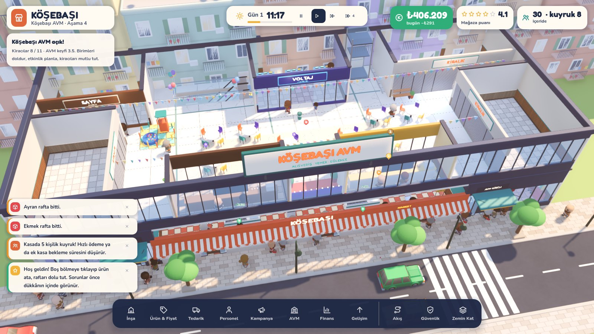

| Süpermarket | AVM 1. kat: yemek katı ve bayram süsü |
|---|---|
| 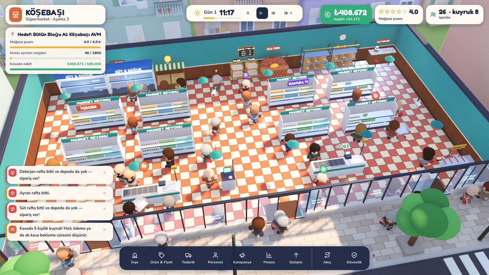 | 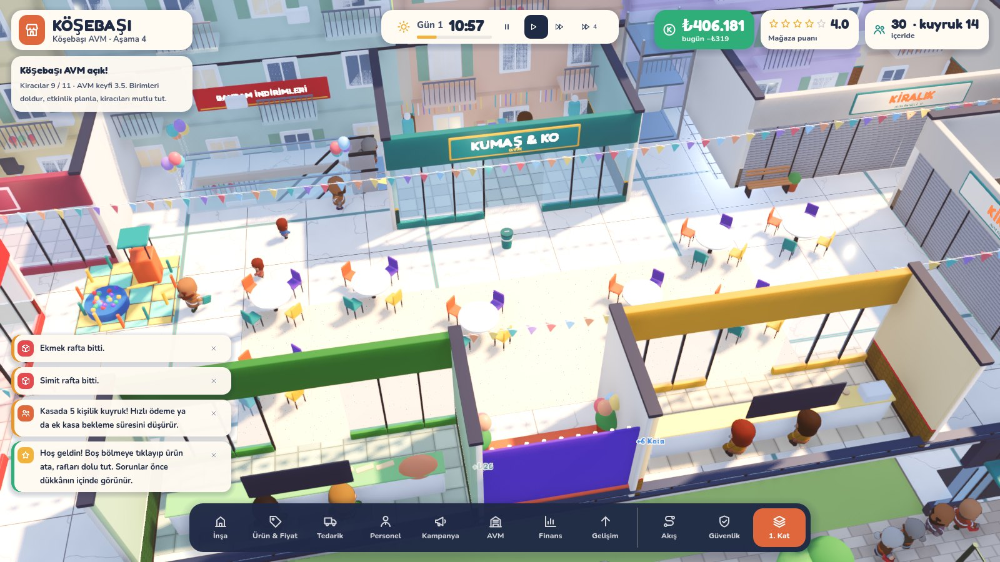 |
| **AVM paneli: kiracılar** | **Kiracı kartı: memnuniyetin gerekçeleri** |
| 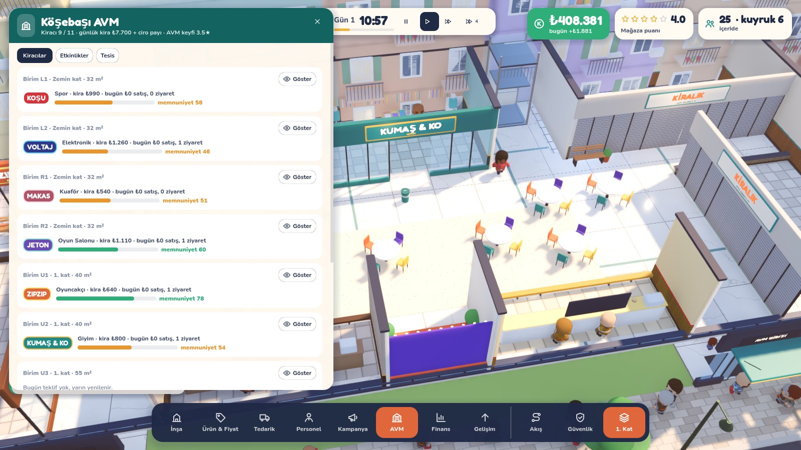 | 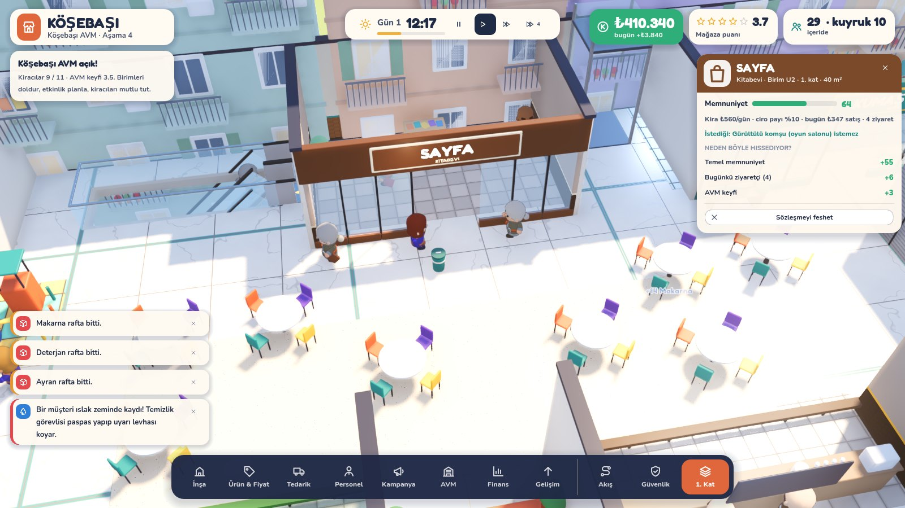 |
| **Kampanyalar** | **Vardiya ve enerji** |
| 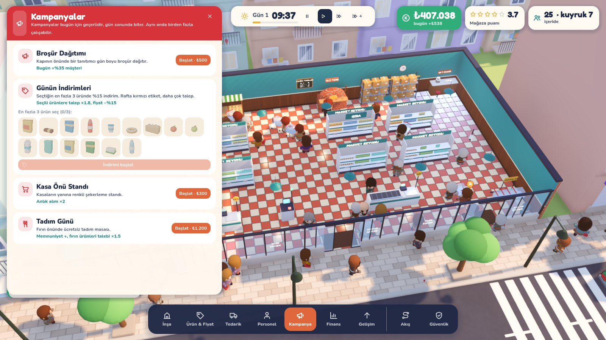 | 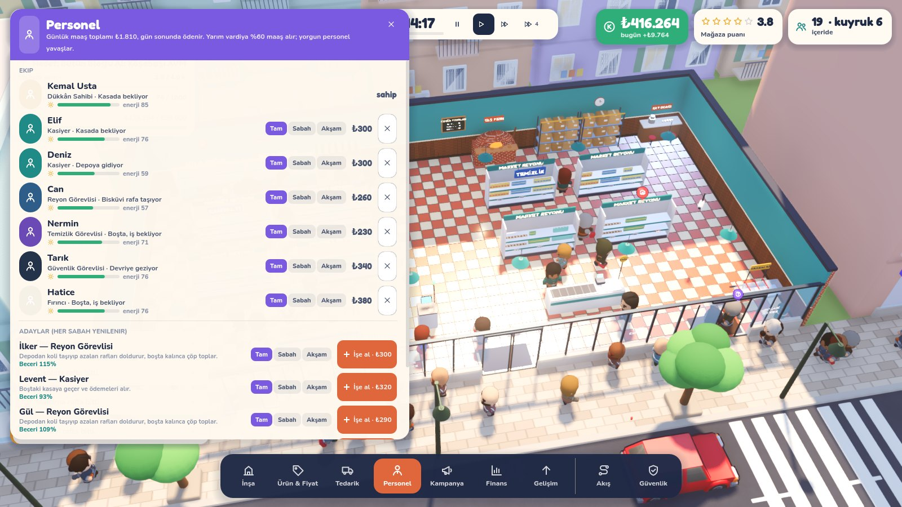 |
| **Güvenlik katmanı (G): kırmızı = kör nokta** | **Mahalle Marketi** |
| 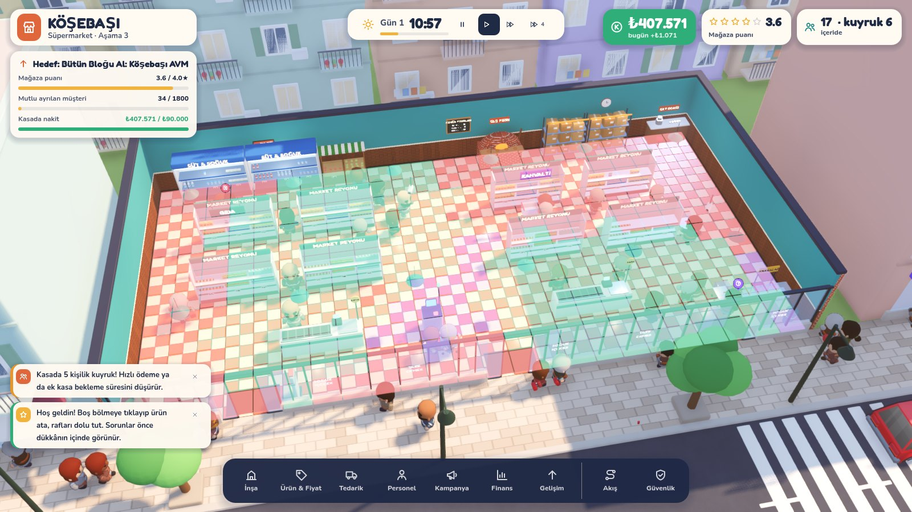 |  |
| **Odalar: soğuk oda, depo odası, gondol başı teşhir** | **Otopark: arabayla gelen müşteri yaya geçidinden geçer** |
| 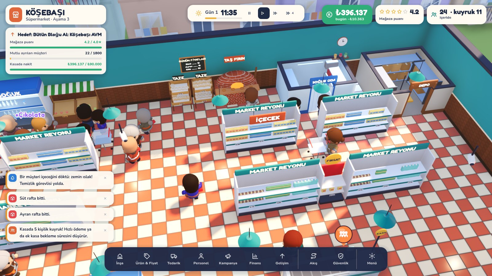 | 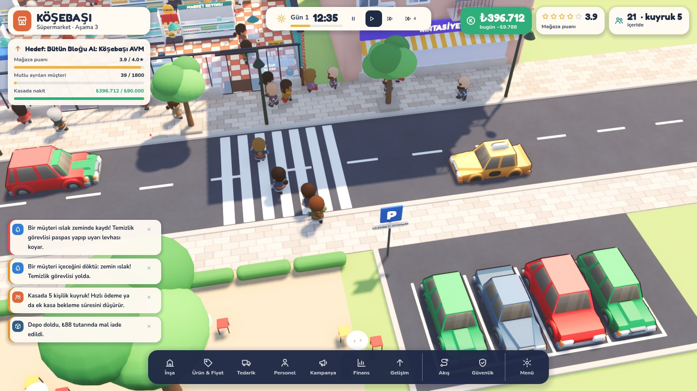 |
| **Sinema, tuvaletler ve cam asansör** | **Ayarlar menüsü** |
| 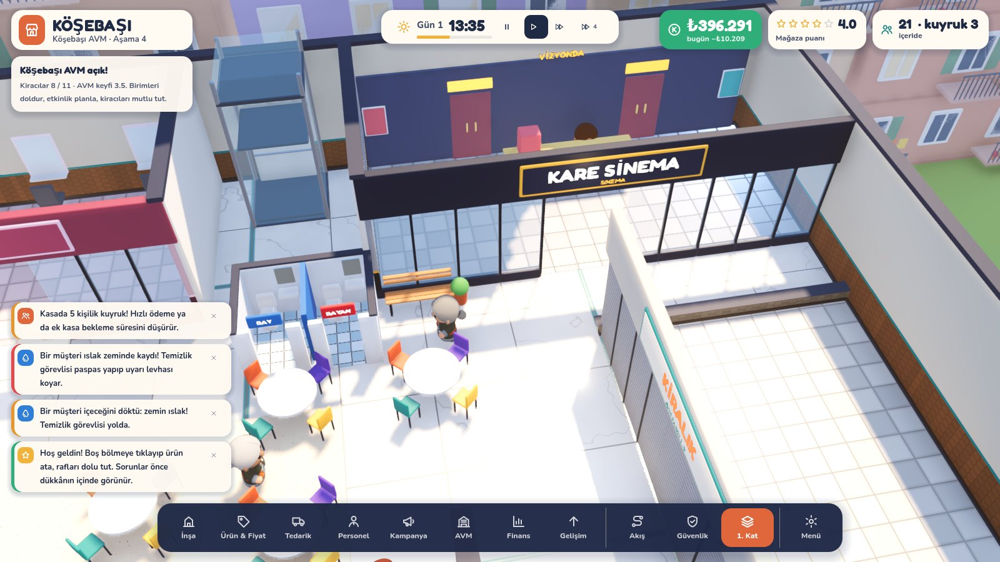 | 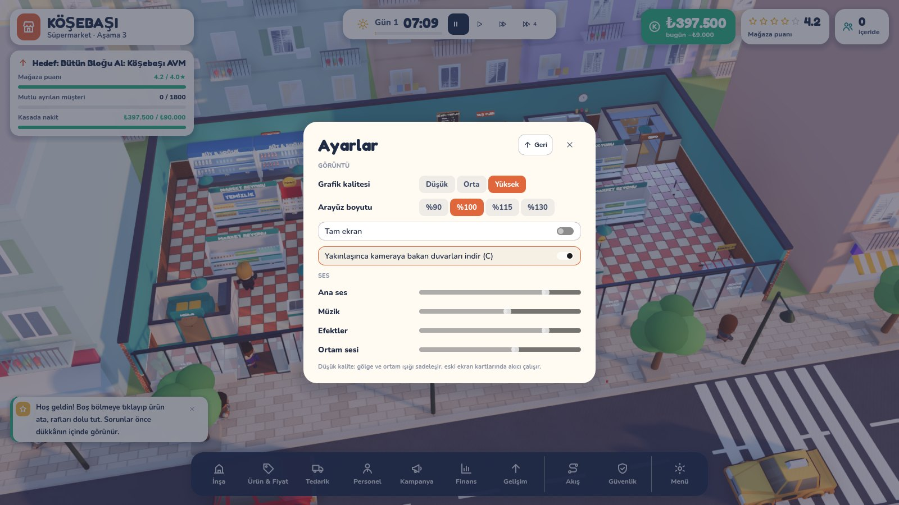 |

| Gece | Rafa ürün atama |
|---|---|
|  |  |
| **Müşteri kartı: liste ve düşünceler** | **Ürün & Fiyat** |
|  |  |

---

## Nasıl çalıştırırım? (Windows)

1. **Godot'yu indir.** https://godotengine.org/download/archive/4.4.1-stable/ adresine git ve **Windows 64-bit** (standart sürüm, *.NET değil*) dosyasını indir.
   - Kurulum yok: ZIP'i bir klasöre çıkar, içindeki `Godot_v4.4.1-stable_win64.exe` dosyası programın kendisidir.
2. **Oyunu indir.** Bu depoyu GitHub'dan ZIP olarak indirip çıkar. Doğru dalı seçmeyi unutma: `claude/inspiring-brahmagupta-85rsvx`.
3. `Godot_v4.4.1-stable_win64.exe`'yi çalıştır. Açılan **Proje Yöneticisi**'nde **İçe Aktar** (Import) düğmesine bas.
4. İndirdiğin klasörün içindeki **`godot/project.godot`** dosyasını seç ve **İçe Aktar ve Düzenle**'ye tıkla.
   - İlk açılışta Godot modelleri ve fontları hazırlar. Bu 1–2 dakika sürebilir.
5. Editör açılınca sağ üstteki **▶ (Oynat)** düğmesine ya da **F5** tuşuna bas. Oyun kendi penceresinde açılır.

Mac ve Linux için de aynı adımları izle; 2. adımda kendi işletim sisteminin Godot dosyasını indir.

**Görüntü açılmazsa ya da ekran kararırsa** (eski ekran kartı sürücüsü): Proje Yöneticisi'nde projeyi seç, sağ tıkla, **Düzenle** de. Üstteki menüden sağ üst köşedeki **Forward+** yazısına tıklayıp **Compatibility**'yi seç, sonra tekrar F5'e bas.

## Kontroller

| Girdi | İşlev |
|---|---|
| Sol tık | Seç (müşteri, personel, raf). Yerdeki çöpe tıklarsan temizlenir |
| Sağ tık + sürükle / `WASD` | Kamerayı kaydır |
| Orta tık + sürükle / `Q` `E` | Kamerayı döndür |
| Tekerlek | Yakınlaş / uzaklaş. Uzaklaşınca cephe, tente ve tabela görünür |
| `B` `P` `T` `H` `F` `U` | İnşa · Ürün & Fiyat · Tedarik · Personel · Finans · Gelişim |
| `K` `V` `N` | Kampanyalar · AVM paneli (kiracılar, etkinlikler, tesis) · Mahalle paneli (veresiye defteri, müdavimler, görevler, rakip) |
| `Ctrl+Z` · `Ctrl+D` | İnşada son yerleştirme, taşıma ya da satışı geri al · Seçili eşyanın aynısını yön ve ürünleriyle kopyala |
| `M` · `G` | Akış ısı haritası · Güvenlik katmanı (kamera ve güvenlik görevlisinin görmediği kör noktalar kırmızı) |
| `PageUp` `PageDown` (ya da `]` `[`) | AVM'de kat değiştir. Dock'taki kat düğmesi de aynı işi yapar |
| `R` | Yerleştirirken döndür. `Shift`+tık: arka arkaya yerleştir. Sağ tık / `Esc`: iptal |
| `Boşluk` · `1` `2` `3` `4` `5` | Duraklat · 1× / 2× / 4× / 8× / 16× hız |
| `C` | Kesik duvar görünümünü aç/kapat |
| `Esc` | Açık paneli / seçimi kapatır; hiçbiri yoksa menüyü açar (Kaydet, Yükle, Ayarlar) |
| Dokunmatik ekran | Tek parmakla kaydır, iki parmakla yakınlaştır ve döndür |
| Oyun kolu | Sol çubuk kamera, sağ çubuk imleç, A tıkla, B geri, X inşa, Y ürünler, LB/RB çevir, LT/RT yakınlaş, Start menü (ayrıntı: `docs/STEAM.md`) |

Klavye tuşlarının hepsi **Ayarlar → Kontroller ve tuş atama**'dan değiştirilebilir. Ctrl+Z, Ctrl+D ve Esc sabittir.

## Görsel yön

Hedef: Two Point serisinin sıcak, okunaklı "oyuncak ev" havası, ama kendi kimliğimizle. **Mahalle Pop** diyoruz: bir Türk mahallesi, bakkal ve market.

- **Dükkân:** terrakota-krem damalı karo, turkuaz boyalı duvarlar, ahşap lambri ve kalın koyu duvar başlıkları. Kameraya bakan duvarlar yakınlaşınca iner. Uzaklaşınca cam vitrin, çizgili tente ve "KÖŞEBAŞI" tabelası görünür, tabela gece neonla yanar.
- **Mahalle:** balkonlu apartmanlar (çatıda su deposu, güneş paneli, çanak anten, balkonda sardunya ve çamaşır ipi), eczane, berber, çay ocağı, kırtasiye. Karşı kaldırımda çay bahçesi ve otobüs durağı var. Yolda taksiler ve öteki arabalar geçiyor, toptancı minibüsü teslimat yapıyor. Gece pencereler ve sokak lambaları yanıyor.
- **Karakterler:** tek tek boyanmış, animasyonlu insanlar. Öğrenci, beyaz yaka, emekli ve aile arketiplerinin her birinin kendi kıyafet paleti var. Ten ve saç rengi rastgele seçiliyor. Yürüme, uzanma, ödeme ve kutu taşıma animasyonları var.
- **Işık:** güneş gün boyu döner, sıcak gün ışığıyla soğuk gölgeler çalışır. Ortam gölgesi (SSAO + SSIL) ve parlak ışıklarda bloom var.
- **Tipografi ve arayüz:** başlıklarda Fredoka, metinlerde Nunito. Renkli başlık bantlı paneller, kalın rakamlar ve koyu bir dock var. İkonlar oyuna özel, elle çizilmiş SVG'ler; emoji yok.

## Bu sürümde neler var

Dört aşamanın dördü de oynanabilir: **Büfe → Mahalle Marketi → Süpermarket → Köşebaşı AVM.** Her genişleme hedeflere bağlı (puan, mutlu müşteri, nakit) ve Gelişim panelinden (`U`) yapılır.

- **Büfe ve Mahalle Marketi:** 8×6 m'lik büfe, genişleyince 16×10 m'lik iki kapılı market. Yandaki kapalı dükkân yıkılır.
- **Süpermarket (24×12 m, üç kapı):** eczane bloğu kalkar.
  - **Bantlı kasa:** bant döner, ödeme %35 daha hızlı.
  - **Self-servis kasa:** kasiyer istemez ama yavaş ve kayıp riski var.
  - **Fırın tezgâhı ve fırıncı:** ucuz simit ve ekmek; "sıcacık" moral bonusu, fırın ağzı parlar.
  - **Reyon levhaları:** levhasız reyonda müşteri rafı daha geç bulur.
  - **Alışveriş arabası parkı:** haftalık alışverişçi araba iter; park yoksa listesi kısalır.
  - **Odalar (personele özel, duvarlı):** personel kapıdan içeri girip çıkar.
    - **Depo Odası:** +240 birim kapasite; satış alanını depo raflarıyla doldurmazsın.
    - **Soğuk Oda:** yoksa depodaki süt, ayran, peynir ve içeceklerin %30'u her gece bozulur.
    - **Mola Odası:** personel çay ocağından iki kat hızlı dinlenir, herkes biraz daha hızlı çalışır.
  - **Ekmek tazeliği:** simit ve ekmek gün içinde bayatlar (rafta "sıcacık / taze / bayat" etiketi). Bayat ekmeği müşteri almayabilir.
    - Satılmayan ekmek gece çöpe gider (gün sonu raporunda zarar olarak görünür).
    - Sabah raflar fırıncının gece pişirdiği ya da fırından gelen ekmekle dolar.
    - İstersen fırın kartından **akşam indirimi** açılır: 19:00'dan sonra %40 ucuz.
  - **Gondol Başı Teşhir:** koridor başındaki teşhir; yanından geçen müşteri listesinde olmasa da ürünü alabilir.
- **Güvenlik ve hırsızlık:**
  - Fırsatçı müşteri kimse bakmıyorsa ürünü cebine atar.
  - Dönen tavan kamerasının görüş konisini yüksek raflar keser.
  - Alarm kapısı kapıda öter, güvenlik görevlisi şüphelinin peşine düşer.
  - `G` katmanı kör noktaları kırmızıyla gösterir.
- **Islak zemin:** soğutucu sızdırır, müşteri içeceğini döker, üstünden geçen kayar. Temizlik görevlisi sarı uyarı levhası koyup paspaslar. Su birikintisine tıklayınca durumu görünür.
- **Vardiya ve yorgunluk:**
  - Vardiyalar: tam gün, sabah ya da akşam. Yarım vardiya %60 maaş alır.
  - Enerji barı: yorgun personel yavaşlar ve çay ocağında mola verir.
  - Personel panelinde her kişi için vardiya düğmeleri ve enerji çubuğu var.
- **Kampanyalar (`K`):**
  - Broşür Dağıtımı: kapıda tanıtımcı durur.
  - Günün İndirimleri: en fazla 3 ürün seçilir, rafta kırmızı etiket çıkar.
  - **3 Al 2 Öde:** seçilen ürünlerde müşteri üçlü alır, üçüncüsü bedava. Rafta sarı "3=2" etiketi çıkar.
  - Kasa Önü Standı ve Tadım Günü.
- **Otopark:** "Otopark Anlaşması" yükseltmesi alınınca yolun karşısında otopark açılır. Haftalık alışverişçiler arabayla gelip park eder, yaya geçidinden karşıya geçer, alışveriş sonrası arabasına dönüp gider. Yaya geçidinde biri varken arabalar durur.
- **Köşebaşı AVM (iki kat):** süpermarket zemin katta kalır, bloğun tamamı alışveriş merkezi olur.
  - **11 kiracı birimi, 11 kurgusal marka:** giyim, elektronik, kitabevi, oyuncakçı, kuaför, oyun salonu, spor, sinema ve üç yemek standı.
  - **Sinema (KARE SİNEMA):** yalnızca büyük birimlere (45 m² üstü) gelir. Seyirci salona girer, film boyunca görünmez, çıkınca AVM keyfi artar. Yemek katı doluysa sinema daha mutlu olur.
  - **Teklifler ve sözleşme:** her sabah yeni teklifler gelir. Kira artı ciro payı alırsın.
  - **Kiracı memnuniyeti gerekçeli:** "yürüyen merdivene uzak", "yanında gürültülü oyun salonu", "sadece 4 koltuk var" gibi. İki gün mutsuz kalan kiracı çıkar.
  - **Kiracı vitrinleri:** marka renginde vitrin, tabela, kendi mobilyası ve tezgâhta çalışan personel. Boş birimde kepenk ve "KİRALIK" levhası var.
  - **Katlar arası ulaşım:** yukarı ve aşağı yürüyen merdiven, cam asansör ve normal merdiven. Ziyaretçiler katlar arasında yol bulur; emekliler asansörü, gençler merdiveni kullanır.
  - **Arızalar:** yürüyen merdiven ya da asansör arızalanabilir; normal merdiven hiç bozulmaz. Arızanın önüne "ARIZALI" bariyeri gelir.
    - Tamir için ya dışarıdan ücretli usta çağırırsın (tıkla) ya da **Teknisyen** işe alırsın.
    - Teknisyen arızaya koşup ücretsiz tamir eder, düzenli bakımla arıza sayısını yarıya indirir.
  - **Tuvalet:** ziyaretçilerin ihtiyacı var. Tuvalet yoksa herkes söylenir, kiracılar da memnuniyetsizleşir. Kullanıldıkça kirlenir, temizlik görevlisi siler.
  - **Yemek katı:** masalar, sahne, çocuk oyun alanı ve banklar. Masalar kirlenir, temizlik görevlisi toplar.
  - **4 etkinlik:** Akşam Konseri (sahnede grup çalar), İmza Günü, Bayram İndirimleri, Çocuk Şenliği. Her birinin kendi süslemesi var (bayrak dizisi, balonlar, pankart). Güvenliksiz kalabalıkta arbede çıkar.
  - **Ziyaretçiler:** 4 arketip (genç, aile, profesyonel, emekli çift). Aileler çocuklarıyla gelir. Ziyaretçiye tıklayınca aklından geçenler görünür.
  - **Görünüm:** kamera kat değiştirince üst kat gizlenir, uzaklaşınca tüm bina ve çatıdaki "KÖŞEBAŞI AVM" tabelası görünür. Kameraya bakan duvarlar ve vitrinler yakınlaşınca iner.
- **Ortak sistemler:**
  - 34 ürün, 28 eşya ve 6 müşteri arketipi. Büfede gazete, sakız, dondurma, salep ve defter; markette yumurta, yoğurt, zeytin, şampuan, hurma ve şemsiye; süpermarkette un, şeker, yağ, donuk pizza, bebek bezi ve şarküteri (sucuk, kaşar) var.
  - **Dondurma dolabı** (büfeden itibaren) ve **şarküteri tezgâhı** (süpermarket). Şarküteriden alışveriş için tezgâhın arkasında bir **Şarküteri Ustası** durmalı; usta kesip tartar, tezgâhı kendisi doldurur.
  - Personel rolleri: kasiyer, reyon görevlisi, temizlik, güvenlik, fırıncı, şarküteri ustası ve teknisyen.
  - **Personel kişilikleri:** adayların çoğunun bir huyu var. Geveze kasiyer yavaş ama müşteriyi güldürür; titiz olan hızlı doldurur; çevik hızlı yürür; güler yüzlü herkesi mutlu eder; dikkatli hırsızı uzaktan görür; keyfine düşkün ve dalgın olanlar ucuzdur ama yavaştır. Çalıştıkça beceri artar, **Eğit** düğmesiyle hızlandırılabilir. Arada biri **zam ister**: reddedersen morali düşer, çok küserse istifa eder.
  - Tedarik: toptancı günde bir kez, sabah 07:05'te gelir. Saat 18:00'de o günkü satışa göre ertesi sabahın siparişi kendiliğinden verilir. Gün içinde lazım olursa **Acil +12** (%25 fazlasına, 1 saatte gelir) var. Depolar büyük: büfe deposu 240, market depo odası 600 ürün alır.
  - **Mahalle olayları:** günde 2–3 kez ekranın üstünde bir kart çıkar ve senden karar ister. Toptancı fırsatı (%30–40 indirimli parti), apartmana toplu sipariş (%20 fazlası ödenir), derbi akşamı (kola/cips talebi 2,5 kat, afiş asarsan +%30 müşteri), zabıta denetimi (çöp ve boş raf cezası ya da puan) ve muhtarın övgüsü.
  - Gün sonu raporu: hırsızlık, kayma, yorgunluk, veresiye, rakip ve AVM satırlarıyla, tavsiyelerle ve yarının hava tahminiyle birlikte.
  - 9 yükseltme; uyarılar, ısı haritası, fare üstü bilgiler.
- **Mahalle hayatı (Mahalle paneli, `N`):**
  - **Müdavimler:** mahallenin isimli sakinleri (Kerime Teyze, Selim Bey, Öğretmen Serap…). Her birinin sevdiği ürünler, alışveriş saati ve sadakati var. Mutlu ayrılan müdavimin sadakati artar; sevdiği ürün yoksa ya da kuyrukta bekletilirse düşer, küserse gelmez olur. Arada biri bir ürün **ister**; 3 gün içinde rafa koyarsan çok sevinir.
  - **Veresiye defteri:** kime yazılacağını (kimseye / sadık müdavimlere / bütün mahalleye) ve kişi başı sınırı sen seçersin. Parası yetmeyen tanıdık deftere yazdırır. Kimi hemen öder, kimi unutur, kimi hiç ödemez. Borçluya **hatırlatabilir** ya da borcu **silebilirsin**; silmek mahallede adını büyütür.
  - **Görevler:** aynı anda üç küçük hedef ("Bugün 45 simit sat", "2 gün hırsızlıksız", "Defterden ₺300 tahsil et"…). Ödüller nakit, puan ya da bedava eşya. Sol üstte ilerlemeleri görünür.
  - **Rakip, UCUZA:** market aşamasına geçtikten iki gün sonra karşı kaldırımda bir indirim zinciri açılır. Temel ürünlerde senden ucuzdur; emekliler ve aileler karşıya geçer (yolda yürüdüklerini görürsün). Fiyatları eşleyebilir, "Taze & Yakın" afişi asabilir, sadık müdavimleri toplayabilir ya da süpermarkette satın alabilirsin. Pazarın %75'ini 7 gün tutarsan kepenk indirir.
  - **Mahalle kedisi:** bir sabah kapıda bir tekir belirir. Sahiplenirsen dükkânda gezinir, depo rafının üstünde uyur; müşteriler bayılır ama arada raftan bir şey düşürür.
  - **Radyo Köşebaşı:** dükkânın hoparlöründen iki saatte bir espri, hava durumu ve mahalle haberleri.
- **Takvim ve hava:** 7 günlük hafta (hafta sonu aileler çoğalır), 14'er günlük mevsimler, okulların açılışı, Ramazan (iftar öncesi ekmek ve pide akını, hurma), Ramazan ve Kurban bayramları, arife. Hava her gün değişir: güneşli, sıcak (dondurma ve soğuk içecek uçar), bulutlu, yağmurlu (şemsiye satılır, kapının önü çamur olur), karlı (salep aranır, sokak sakinleşir). Yağmur ve kar ekranda yağar; yarının tahmini saat kartında ve gün sonu raporunda.
- **Ekonomi:**
  - Elektrik faturası dolap, dondurucu, fırın ve soğuk oda sayısına göre hesaplanır; çatıya güneş paneli %40 düşürür.
  - Toptancı haftada bir zam yapar; müşterilerin "normal fiyat" beklentisi de artar. Ürün & Fiyat panelindeki düğmeyle bütün fiyatlar bir kerede güncellenir.
  - Mahalle Bankası'ndan üç büyüklükte kredi çekilebilir; taksit her gün sonunda düşülür, erken kapatılabilir.
  - Süpermarkette **Köşebaşı Markası** yükseltmesi temel ürünlerin maliyetini %20 düşürür.
  - **Ürün analizi** (Ürün & Fiyat → Analiz): son 7 günün satışları, kâr, kaçan satış, rafın boş kaldığı süre, kimin aldığı ve her ürün için bir öneri ("Rafa koy!", "Fiyat yüksek", "Stok yetmiyor", "Durgun").
- **Mahalleler (senaryolar) ve başarımlar:** açılış ekranındaki **Mahalleler** düğmesinden: Moda Sahili (batmak üzere olan marketi 30 günde kurtar), Kampüs Yolu (12 günde 1.400 mutlu öğrenci), Çarşı (karşıdaki güçlü UCUZA'yı 28 günde kapattır) ve Serbest Mod (₺250.000, hedefsiz). Kazanılan mahallelere madalya işlenir. 23 başarım var; menüden görülebilir.
- **Rehber:** yeni oyunda sol üstte 8 adımlık bir kontrol listesi, sıradaki adımın dock düğmesini yanıp söndürür. Kapatılabilir, bir kez bitince bir daha çıkmaz.
- **Dil:** açılış ekranından ya da Ayarlar → Dil / Language ile İngilizce seçilebilir. İngilizcede simit, ayran, salep, sucuk, kaşar, pide, veresiye, bayram, muhtar, zabıta, usta, teyze/amca/abi, hanım/bey gibi kelimeler bilerek Türkçe kalır: ilk görüldüklerinde sağ altta "New word" kartı kısa bir açıklama gösterir, fare üstü bilgilerde de açıklama çıkar. Tüm liste menüdeki **Sözlük** sayfasında.
- **Kayıt ve ayarlar:**
  - Oyun her sabah otomatik kaydedilir. Açılış ekranında "Devam et" düğmesi çıkar.
  - Menüden (`Esc`) 3 kayıt yuvasına kaydedip yükleyebilirsin. Yüklenen oyun o günün sabahından başlar.
  - Menüden (`Esc`) 3 yuvaya kaydedilen oyun **günün o anından** devam eder: saat, günün istatistikleri, kampanyalar, personelin yorgunluğu ve yoldaki minibüs saklanır. İçerideki müşteriler saklanmaz.
  - Kayıt önce geçici dosyaya yazılır, doğrulanır, sonra yerine konur; bir önceki kayıt `.bak` olarak durur. Dosya bozulursa yedekten açılır, eski sürüm kayıtları otomatik yükseltilir.
  - Ayarlar: grafik kalitesi, pencere boyutu, kare sınırı (30/60/120/sınırsız), VSync, arayüz boyutu, tam ekran, kesik duvar, 4 ses kanalı. Ayarlar kalıcıdır.
  - **Erişilebilirlik:** yazı boyutu (Normal / Büyük / Çok büyük), renk körü dostu renkler (yeşil/kırmızı yerine mavi/turuncu; yerleştirme önizlemesi dahil), tuş atama.
  - Kayıtlar Windows'ta `%APPDATA%\Godot\app_userdata\Tezgâh` klasöründe durur.
- **Ses:** tüm sesler kodla sentezleniyor, hiçbir ses dosyası yok.
  - Efektler: yazar kasa, kapı çıngırağı, alarm, kayma, yerleştirme, uyarı ve arayüz sesleri, güvenlik düdüğü, veresiye defterine yazarken kalem, genişlemede fanfar.
  - Kedi kapıda miyavlar, uyurken mırlar. Radyo anonsları cızırtı ve üç notalı istasyon cıngılıyla başlar.
  - Müzik: gündüz ve akşam için iki ayrı parça, saate göre yumuşakça geçer.
  - Ortam: sokak uğultusu ve kuş sesi; dükkân doldukça kalabalık uğultusu artar. Yağmurda yağmur ve ara sıra gök gürültüsü, karda rüzgâr, bulutlu havada hafif esinti duyulur.
- **Puan kırılımı:** üst bardaki puana tıkla: bugün müşterileri neyin mutlu ya da mutsuz ettiği, kaç kez olduğu ve ne yapılacağı. Her yeni aşamada o aşamanın kısa rehberi açılır.
- **Krizler (Mahalle Marketi'nden sonra):** elektrik kesintisi (jeneratör kirala ya da soğuk ürünlerin bir kısmı bozulsun), patlayan su borusu (tesisatçı ya da paspas), nakliyeci grevi (kendi kamyonetinle al ya da teslimat öğleden sonraya kalsın). Kırmızı kartla gelir; cevap verilmezse "bekle" seçilmiş sayılır.
- **Dekorasyon:** ayaklı lamba, çiçek standı, akvaryum, AVM'ye süs havuzu. Hepsi bitki gibi çevresini keyifli yapar ve kuyruk sabrını artırır.
- **İkinci rakip:** kariyerde UCUZA kapandıktan birkaç gün sonra boş dükkânı **NOKTA 7/24** kiralar. Atıştırmalık ve içeceklerde ucuzdur, öğrencileri ve çalışanları çeker. O da kapatılabilir ya da satın alınabilir.
- **Şubeler (AVM'den sonra):** Gelişim panelinden Kampüs Yolu, Moda Sahili ve Çarşı'da şube açılır. Her şubenin yönü (ucuzluk / denge / kalite), müdürü ve büyüklüğü seçilir. Her akşam kasasını gün sonu özetine bildirir. Senaryosu kazanılmış mahallede şube %25 ucuz ve daha kalabalıktır.
- **Demo:** "Windows Demo" dışa aktarım profili kariyeri Mahalle Marketi'nde durdurur, mahallelerden yalnızca Moda açıktır. İstek listesi düğmesi mağaza sayfasına gider.
- **Steam:** isteğe bağlı GodotSteam eklentisiyle başarımlar ve arkadaş listesinde durum. Steam Deck'te ilk açılışta arayüz ve yazı büyür. Kurulum ve mağaza metinleri: `docs/STEAM.md`, `docs/STEAM_PAGE.md`, görseller `docs/store/`.

## Sınırlar (açıkça)

- İngilizce çeviri arayüzü, uyarıları, müşteri düşüncelerini, verileri ve radyoyu kapsıyor; dükkân tabelaları, ürün ambalajları gibi 3B yazılar bilerek Türkçe kaldı. Bazı fare üstü bilgilerde Türkçe parça kalabilir.
- Şubeler uzaktan yönetilen bir katmandır: şubelerin içi oynanmaz, her akşam bir hesap özeti gelir.
- Kayıtta o an içerideki müşteriler saklanmaz; yüklenince dükkân boş başlar, saat ve günün sayıları kaldığı yerden devam eder.
- **Derleme:** depoda `.exe` yok (klasör `.gitignore`'da). Editörde **Proje → Dışa Aktar**'da üç hazır profil var: Windows, Windows Demo, Linux. Bu ortamda üçü de komut satırından dışa aktarıldı (Windows ≈110 MB). Linux derlemesi başsız (headless) çalıştırıldı, bir günü sorunsuz oynadı, İngilizce çeviri dosyaları da derlemede. **Windows `.exe`'si hiç çalıştırılmadı** (burada Windows yok).
- **Performans:** yalnızca CPU tarafı ölçüldü. 2,1 GHz'lik bir Xeon çekirdeğinde 30 oyun günü (süpermarkete kadar) 515 saniyede simüle edildi; bu, 1× hızın yaklaşık 26 katı. Ekran kartı performansı ölçülmedi: buradaki görüntüler yazılımsal Vulkan'la (llvmpipe) çekiliyor. Gerçek bir makinede FPS'e ve özellikle AVM'nin kalabalık saatlerine bakılmalı. Eski kartlarda "Düşük" kalite ve kare sınırı var.
- **Denge:** `--bot=GÜN` ile çalışan otomatik bir "ortalama oyuncu" (`scripts/tools/autoplayer.gd`) kariyeri oynuyor. Son koşularda Mahalle Marketi 9.–11. günde (≈1–1,5 saat), Süpermarket 28. günde açıldı; Moda senaryosunu 22. günde kazandı, Kampüs'te hedefin %90'ına ulaştı. Puan artık son ~40 müşterinin ortalaması gibi davranıyor; önceden akşamın son birkaç müşterisi puanı bir günde 1,5 yıldız oynatabiliyordu. Bot, büfede asıl puan kaybının boş raflar olduğunu gösterdi: otomatik sipariş depoyu ilk ürünlerle doldurup sonrakileri aç bırakıyordu (düzeltildi), depo akşamdan boşalınca artık uyarı çıkıyor. Market aşamasında botun puanı 2–3 arasında kalıyor; nedeni büyük ölçüde botun sıkışık yerleşimi ve az kasası (dar koridor, kuyruktan vazgeçme). Gerçek oyuncularla test yapılmadı; hedeflerin zorluğu oynayarak ayarlanmalı.
- Steam, GodotSteam, oyun kolu ve Steam Deck bu ortamda yok: köprü kodu derleniyor ve eklenti yokken sessiz kalıyor, ama gerçek bir Steam girişi, başarım eşitleme ve kolla oynanış denenmedi.

## Varlıklar ve lisanslar

- **Kendi yaptıklarımız** (kodla üretilen): dükkân, raflar, dolaplar, kasa, manav, ürünler, apartmanlar, sokak, minibüs, tabelalar, tüm shader'lar (damalı karo, boyalı duvar, tuğla, kilit parke, asfalt, tente kumaşı) ve ikonlar.
- **KayKit** (Kay Lousberg, CC0): karakter gövdeleri ve animasyonları (Adventurers paketi; silahları, pelerinleri ve şapkaları çıkarıp kıyafetleri kendi paletimizle yeniden boyuyoruz), birkaç küçük eşya (kasalar, sandalye, dolap), şehir paketinden arabalar ve yangın musluğu. Lisans dosyaları `assets/` klasöründe.
- **Fontlar:** Fredoka ve Nunito (SIL Open Font License), lisansları `assets/fonts/` klasöründe.

## Kod yapısı

```
godot/
  project.godot          ana sahne: scenes/main.tscn
  scripts/core/          cfg.gd (sabitler, palet), db.gd (ürünler, eşyalar, arketipler, aşamalar, kampanyalar),
                         save.gd (JSON kayıt), settings.gd (ayarlar), game_audio.gd (ses sentezi, müzik, ortam),
                         mall_db.gd (AVM birimleri, kiracılar, ziyaretçiler, etkinlikler, merdiven/asansör)
  scripts/sim/           grid.gd (A*, kapı kenarları, katlar), fixture.gd, agent.gd (katlar arası bacaklar),
                         customer.gd, staff.gd (vardiya, görevler), mall.gd (kiracı, etkinlik, arıza), visitor.gd
  scripts/game.gd        simülasyon döngüsü (1/30 s sabit adım), ekonomi, yerleştirme, gün, genişleme
  scripts/world/         art.gd (malzemeler, fontlar, yuvarlatılmış kutu), props.gd (eşya modelleri),
                         products3d.gd, character.gd, shop.gd, street.gd, sky.gd, camera_rig.gd, overlays.gd,
                         mall_shell.gd (AVM binası: katlar, vitrinler, yürüyen merdiven, asansör, sahne, süslemeler)
  scripts/core/          keys.gd (tuş atama, kol eşlemesi), pad_cursor.gd (kol imleci), steam_bridge.gd (isteğe bağlı Steam),
                         demo.gd (demo sınırları), glossary.gd (kültürel kelimeler), loc.gd (çeviri), progress.gd (başarımlar)
  scripts/sim/           rival.gd (UCUZA, NOKTA 7/24), branches.gd (şubeler), neighbor_events.gd (olaylar, krizler)
  scripts/tools/         autoplayer.gd (denge botu: --bot=GÜN)
  scripts/ui/            ui_kit.gd (tema), thumbs.gd (3D küçük resimler), hud.gd, hud_extra.gd
  shaders/               checker, wall_paint, brick, paving, asphalt, stripes, terrazzo, marble, escalator,
                         belt, shutter, character (yeniden boyama)
```
