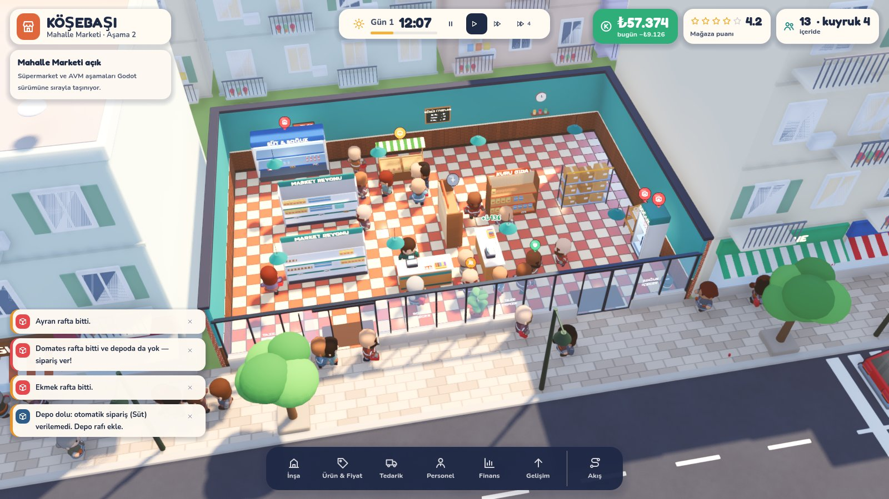
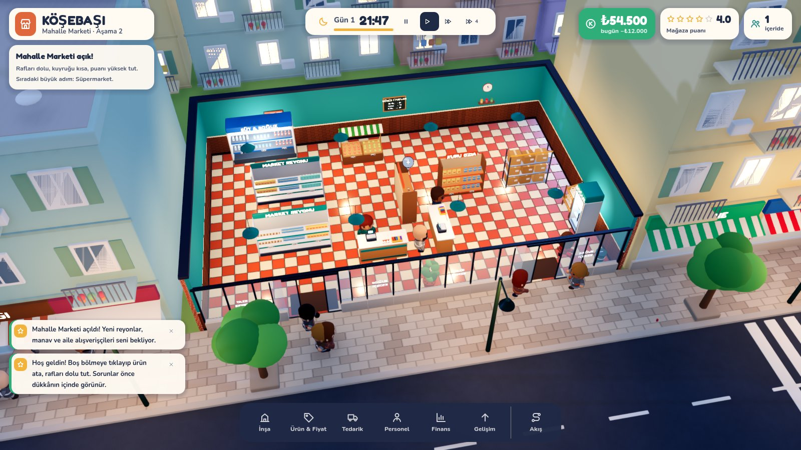
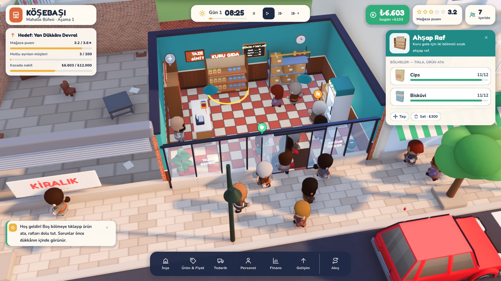
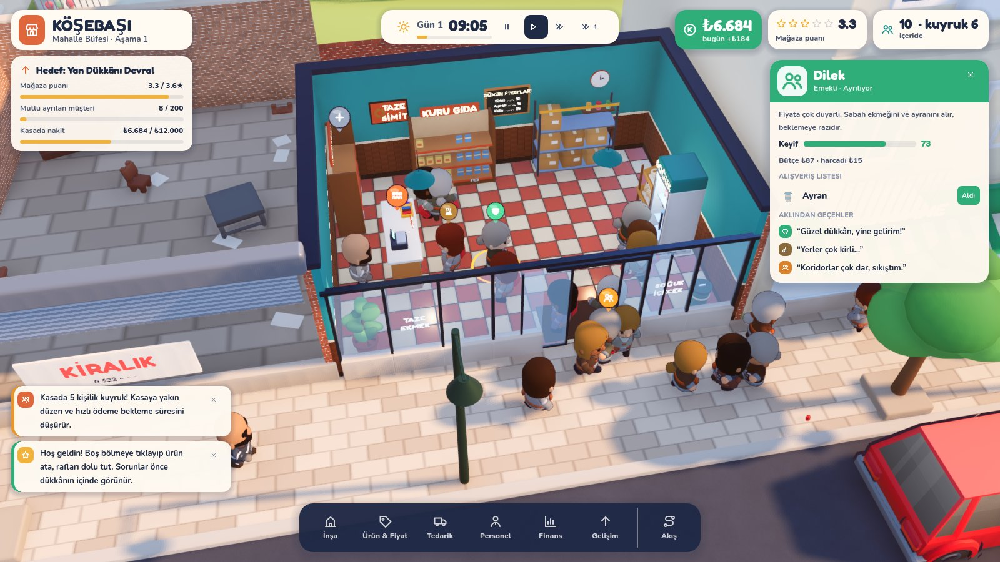
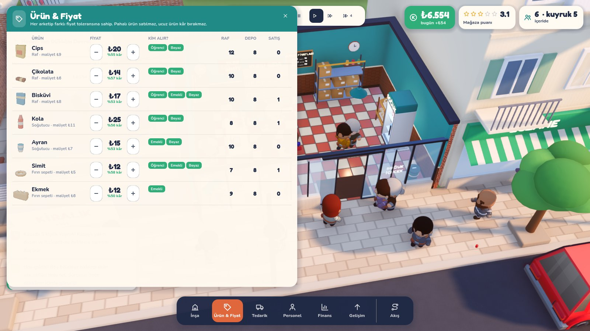

# Tezgâh — Godot sürümü

Oyunun yeni ana sürümü. Masaüstünde normal bir oyun gibi çalışır; tarayıcı, `npm` ya da Node.js gerekmez.



| Gece | Rafa ürün atama |
|---|---|
|  |  |
| **Müşteri kartı: liste ve düşünceler** | **Ürün & Fiyat** |
|  |  |

---

## Nasıl çalıştırırım? (Windows)

1. **Godot'yu indir.** https://godotengine.org/download/archive/4.4.1-stable/ adresine git ve **Windows 64-bit** (standart sürüm, *.NET değil*) dosyasını indir.
   - Kurulum yok: ZIP'i bir klasöre çıkar, içindeki `Godot_v4.4.1-stable_win64.exe` dosyası programın kendisidir.
2. **Oyunu indir.** Bu depoyu GitHub'dan ZIP olarak indirip çıkar. Doğru dalı seçmeyi unutma: `claude/inspiring-brahmagupta-85rsvx`.
3. `Godot_v4.4.1-stable_win64.exe`'yi çalıştır. Açılan **Proje Yöneticisi**'nde **İçe Aktar** (Import) düğmesine bas.
4. İndirdiğin klasörün içindeki **`godot/project.godot`** dosyasını seç ve **İçe Aktar ve Düzenle**'ye tıkla.
   - İlk açılışta Godot modelleri ve fontları hazırlar. Bu 1–2 dakika sürebilir.
5. Editör açılınca sağ üstteki **▶ (Oynat)** düğmesine ya da **F5** tuşuna bas. Oyun kendi penceresinde açılır.

Mac ve Linux için de aynı adımları izle; 2. adımda kendi işletim sisteminin Godot dosyasını indir.

**Görüntü açılmazsa ya da ekran kararırsa** (eski ekran kartı sürücüsü): Proje Yöneticisi'nde projeyi seç, sağ tıkla, **Düzenle** de. Üstteki menüden sağ üst köşedeki **Forward+** yazısına tıklayıp **Compatibility**'yi seç, sonra tekrar F5'e bas.

## Kontroller

| Girdi | İşlev |
|---|---|
| Sol tık | Seç (müşteri, personel, raf). Yerdeki çöpe tıklarsan temizlenir |
| Sağ tık + sürükle / `WASD` | Kamerayı kaydır |
| Orta tık + sürükle / `Q` `E` | Kamerayı döndür |
| Tekerlek | Yakınlaş / uzaklaş. Uzaklaşınca cephe, tente ve tabela görünür |
| `B` `P` `T` `H` `F` `U` | İnşa · Ürün & Fiyat · Tedarik · Personel · Finans · Gelişim |
| `M` | Akış (müşteri trafiği) ısı haritası |
| `R` | Yerleştirirken döndür. `Shift`+tık: arka arkaya yerleştir. Sağ tık / `Esc`: iptal |
| `Boşluk` · `1` `2` `3` | Duraklat · 1× / 2× / 4× hız |
| `C` | Kesik duvar görünümünü aç/kapat |
| Dokunmatik ekran | Tek parmakla kaydır, iki parmakla yakınlaştır ve döndür |

## Görsel yön

Hedef: Two Point serisinin sıcak, okunaklı "oyuncak ev" havası, ama kendi kimliğimizle. **Mahalle Pop** diyoruz: bir Türk mahallesi, bakkal ve market.

- **Dükkân:** terrakota-krem damalı karo, turkuaz boyalı duvarlar, ahşap lambri ve kalın koyu duvar başlıkları. Kameraya bakan duvarlar yakınlaşınca iner. Uzaklaşınca cam vitrin, çizgili tente ve "KÖŞEBAŞI" tabelası görünür, tabela gece neonla yanar.
- **Mahalle:** balkonlu apartmanlar (çatıda su deposu, güneş paneli, çanak anten, balkonda sardunya ve çamaşır ipi), eczane, berber, çay ocağı, kırtasiye. Karşı kaldırımda çay bahçesi ve otobüs durağı var. Yolda taksiler ve öteki arabalar geçiyor, toptancı minibüsü teslimat yapıyor. Gece pencereler ve sokak lambaları yanıyor.
- **Karakterler:** tek tek boyanmış, animasyonlu insanlar. Öğrenci, beyaz yaka, emekli ve aile arketiplerinin her birinin kendi kıyafet paleti var. Ten ve saç rengi rastgele seçiliyor. Yürüme, uzanma, ödeme ve kutu taşıma animasyonları var.
- **Işık:** güneş gün boyu döner, sıcak gün ışığıyla soğuk gölgeler çalışır. Ortam gölgesi (SSAO + SSIL) ve parlak ışıklarda bloom var.
- **Tipografi ve arayüz:** başlıklarda Fredoka, metinlerde Nunito. Renkli başlık bantlı paneller, kalın rakamlar ve koyu bir dock var. İkonlar oyuna özel, elle çizilmiş SVG'ler; emoji yok.

## Bu sürümde neler var

- **Büfe → Mahalle Marketi:** iki aşamanın ikisi de oynanabilir. Hedefler: 3,6★ puan, 200 mutlu müşteri, ₺12.000 nakit. Genişleyince yandaki kapalı dükkân yıkılır ve iç mekân 16×10 m olur.
- **10 eşya:** ahşap raf, içecek dolabı, fırın sepeti, kasa, depo rafı, saksı, çöp kovası, gondol, manav tezgâhı, açık soğutucu. Hepsi yerleştirilebilir, taşınabilir, döndürülebilir ve satılabilir.
  - Yerleştirme kurallarını ızgara ve yol bulma denetler: kapı önü boş kalmalı, rafın önü açık olmalı, kasiyerin duracağı yer olmalı, hiçbir şey ulaşılamaz hâle gelmemeli.
- **11 ürün**, raflarda tek tek 3D olarak durur ve satıldıkça azalır. Fiyat etiketinin rengi stok durumuna göre değişir.
- **4 müşteri arketipi:**
  - Her birinin bütçesi, listesi, fiyat toleransı, sabrı ve saatlik talep eğrisi farklı.
  - Müşteriler rafı arar, fiyata bakar, en kısa kuyruğa girer, öder ya da vazgeçer.
  - Kasanın yanında anlık alım yapabilirler, yere çöp atabilirler.
  - Tepkilerini başlarının üstündeki baloncuklarla gösterirler. Müşteriye tıklayınca "aklından geçenler" listesi açılır.
- **Personel:** sahibi (Kemal Usta), kasiyer ve reyon görevlisi. Reyon görevlisi depodan koli taşıyıp rafları doldurur, boş kalınca çöp toplar. Reyon görevlisi yoksa sahip kasayı bırakıp rafa koşar.
- **Tedarik:** elle ya da otomatik sipariş verilir, depo kapasitesi sınırlıdır. Toptancı minibüsü sokağa gelip mal indirir.
- **Gün döngüsü:** 07:00–22:00 arası. Gün sonunda kira ve maaş ödenir, bir rapor ve otomatik öneriler çıkar.
- **5 yükseltme:** Neon Tabela, Temassız POS, Yeni Tente, Elektronik Etiket, Raf Aydınlatması.
- **Arayüz:** üst bilgi çubuğu, dock, 6 panel, inceleme kartları, uyarılar (tıklayınca kamera sorunun yerine gider), yerleştirme ipucu, fare üstü bilgi kutusu, akış ısı haritası, gün sonu raporu ve açılış ekranı.

## Henüz Godot'ya taşınmayanlar (açıkça)

Web sürümünde (depo kökü, `npm run dev`) olup buraya henüz gelmeyenler:

- **Süpermarket ve AVM aşamaları.** Bantlı ve self-servis kasalar, fırın, reyon levhaları, kiracılar, katlar, yürüyen merdivenler, etkinlikler.
- **Güvenlik ve hırsızlık**, **ıslak zemin**, **vardiya ve yorgunluk**, **kampanyalar**.
- **Kayıt / yükleme** ve **ayarlar menüsü.** Oyun her açılışta baştan başlar.
- **Müzik ve ses efektleri.** Şu an ses yok.
- Depoda hazır bir `.exe` yok. Oyun editörden F5 ile çalışır. Tek dosyalık `.exe` istersen: editörde **Proje → Dışa Aktar** (Project → Export) menüsüne gir, Godot bir kez "Export Templates" indirmeni isteyecek, kabul et. Ardından hazır **Windows** ayarıyla **Proje Dışa Aktar**'a bas. `export/Tezgah.exe` oluşur. (Dışa aktarma ayarı depoda hazır, ancak bu adımı kendi ortamımda deneyemedim; editörden F5 ile çalıştırmayı test ettim.)
- Denge sadece başsız testlerle ayarlandı, gerçek oyuncularla oynanmadı.

## Varlıklar ve lisanslar

- **Kendi yaptıklarımız** (kodla üretilen): dükkân, raflar, dolaplar, kasa, manav, ürünler, apartmanlar, sokak, minibüs, tabelalar, tüm shader'lar (damalı karo, boyalı duvar, tuğla, kilit parke, asfalt, tente kumaşı) ve ikonlar.
- **KayKit** (Kay Lousberg, CC0): karakter gövdeleri ve animasyonları (Adventurers paketi; silahları, pelerinleri ve şapkaları çıkarıp kıyafetleri kendi paletimizle yeniden boyuyoruz), birkaç küçük eşya (kasalar, sandalye, dolap), şehir paketinden arabalar ve yangın musluğu. Lisans dosyaları `assets/` klasöründe.
- **Fontlar:** Fredoka ve Nunito (SIL Open Font License), lisansları `assets/fonts/` klasöründe.

## Kod yapısı

```
godot/
  project.godot          ana sahne: scenes/main.tscn
  scripts/core/          cfg.gd (sabitler, palet), db.gd (ürünler, eşyalar, arketipler, aşamalar)
  scripts/sim/           grid.gd (A*, erişim), fixture.gd, agent.gd, customer.gd, staff.gd
  scripts/game.gd        simülasyon döngüsü (1/30 s sabit adım), ekonomi, yerleştirme, gün, genişleme
  scripts/world/         art.gd (malzemeler, fontlar, yuvarlatılmış kutu), props.gd (eşya modelleri),
                         products3d.gd, character.gd, shop.gd, street.gd, sky.gd, camera_rig.gd, overlays.gd
  scripts/ui/            ui_kit.gd (tema), thumbs.gd (3D küçük resimler), hud.gd
  shaders/               checker, wall_paint, brick, paving, asphalt, stripes, character (yeniden boyama)
```
